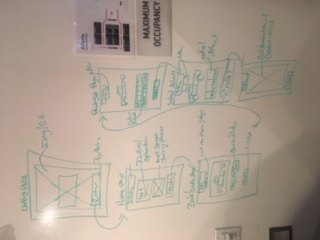
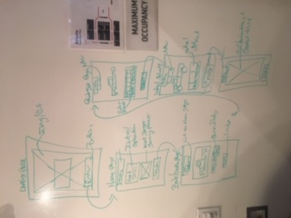
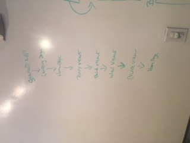

<!-- Links to Heroku and Trello Board -->
Heroku Link = "https://stanceworld.herokuapp.com/"

Trello Board = "https://trello.com/b/JWURh4O8/project-4"     

<!-- WireFrame Erd Whiteboard -->

            

<!-- Stanced World -->
Hello and welcome to Stanced World. This program is a car designer application that allows you to choose the car body, color and wheels. At this current moment the application is in beta mode and is in need of some upgrades but the basic level functionality is present. For those wondering, "Stanced" refers to a style of customization on vehicles where the suspension and wheels are setup in such a way that vehicle rides lower and in a more aggressive fashion. 

